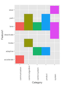

<!-- README.md is generated from README.Rmd. Please edit that file -->

```{r, echo = FALSE}
knitr::opts_chunk$set(
  collapse = TRUE,
  comment = "#>",
  fig.path = "README-"
)
```

Introducing `patentr`, the toolkit for patent data analysis in R. The summary md
file currently holds all documentation. 


The package is aimed at patent agents, lawyers, managers, analysts, and 
academics who are working on patents. This may be used in a patent landscape 
analysis, company IP portfolio analysis, or a freedom to operate search. 

This is a data processing and reporting tool on patent data sets for 
patent analysts. The motivation comes from a lack of useful, exportable 
patent data. `patentr` builds upon the free data available from Sumobrain.com, 
Lens.org, and Google Patents, leveraging their data to summarize and analyze 
patents. 

`patentr` performs four key functions:

 1. *Data input:* Easily **import** patent excel and csv files from the top patent websites
  + `CSV` from Google Patents and lens.org
  + `xlsx` from sumobrain.com 
 2. *Data cleaning:* **Sanitize** patent data and extract useful metadata for custom analyses
  + Clean up important fields such as names, dates, country codes, and kind codes
  + Infer the document type so that you don't analyze the same patent twice
  + Deduplicate data sets and prioritize grants over applications 
  + Use the generated Google URL to jump to the patent document or to download 
  claim data using the included `httr` and `XML` functions
 3. *Exploratory data analysis:* **Explore** patent data and quickly **visualize** important attributes 
  + Quickly summarize patent data by relevant columns to get document count 
  + View standard histogram, tile, and facet plots of important information 
  + Extract claim information for **wordcloud** analysis 
  + Interact with your data on the **Shiny** user interface
 4. *Reporting:* Export your data as **powerpoints** and **PDFs** 
  + Browse through the **many example plots** 
  + Download your charts locally as a **PDF** or make your own **PPTX** 

**Note:** The Shiny app works only with `xlsx` data. Simply upload the data file,
click "clean", and then you can view a straightforward graph and the raw data.

There are three core date sets available, all based on autonomous car patent sets:
`acars` (from Sumobrain.com), `acarsLens`, and `acarsGoogle`. All data sets are 
reproducible and their sources can be found in their documentation. 

## Data Input and Data Sources

Choose your data from Sumobrain.com for excel files, or Lens.org and Google Patents 
for `csv` files. 

You can read in patent data files from publicly available sources and clean the 
data into a more useful, usable format for further analysis. `patentr` has an 
**interactive** browser that allows you to choose a **list** of files of xlsx 
format. Alternatively, you can read in your own `csv` files. 
```{r, eval=FALSE}
# read in xlsx files
file1 <- system.file("extdata/", "sumobrain_autonomous_search1.xlsx", package="patentr")
file2 <- system.file("extdata/", "sumobrain_autonomous_search2.xlsx", package="patentr")
files <- list(file1, file2)
ipData <- importPatentData(rawDataFilePath = files, skipLines = 1)
# example 2 -- a popup window appears for you to choose xlsx files
filePaths <- chooseFiles()
allData <- importPatentData(filePaths)
# example 3 -- read in csv files
google <- read.csv(system.file("testData/","google_autonomous_search.csv", package ="patentr")
                 skip = skipGoogle, stringsAsFactors = FALSE)
google <- data.frame(lapply(lens,function(x){iconv(x, to = "ASCII")}), stringsAsFactors = FALSE)
  

```


## Clean Data

There are ten different cleaning functions available, all wrapped up nicely into 
the `cleanPatentData` function. This single function can save you hours of work 
cleaning and processing your data. Read the documentation carefully, as there are 
a number of time-saving preloaded variables to name the columns, process the 
dates, clean up the assignee names, and much more.

For excel files, use the `cleanPatentData` function directly. For csv files, 
use the pre-processing lines below. 

Clean data uses `extract` functions that take in character vectors and return 
extracted metadata useful in patent data analysis. A master cleaner function
bundles all these functions together. The user also has the ability to use the 
functions one-by-one for custom analysis. 

```{r, eval=FALSE}
lensRawData <- system.file("extdata", "lens_autonomous_search.csv", package = "patentr")
lensRawData <- read.csv(lensRawData, stringsAsFactors = FALSE, skip = skipLens)
lensRawData <- data.frame(lapply(lensRawData,
function(x){iconv(x, to = "ASCII")}), stringsAsFactors = FALSE)
lens <- cleanPatentData(patentData = lensRawData, columnsExpected = lensColumns,
cleanNames = lensNames, dateFields = lensDateFields, dateOrders = lensDateOrder,
deduplicate = TRUE, cakcDict = patentr::cakcDict, docLengthTypesDict = patentr::docLengthTypesDict,
keepType = "grant", firstAssigneeOnly = TRUE, assigneeSep = ";;", stopWords = patentr::assigneeStopWords)
```


## Exploratory Analysis 

The exploratory analysis includes simple summaries and numerous graphings. Ideally,
a patent analyst needs to add the following columns to the cleaned data to make 
full use of the package:
 * score 
 * category 
 * feature 1 (main feature)
 * feature 2 (secondary feature)

For the purpose of this first package, all examples come with a pre-built 0 to 3
score, 3 being the highest. Categories are also predefined, as is feature 1. These 
are important variables that require days to weeks of a patent analysts time, thus,
in future realeases an expert-tagged data set will be available. 

A simple example is the word cloud. We load a file, deduplicate it, and then 
quickly view the top phrases. Another example is a simple facet that shows 
the category of a patent technology, along with the major feature of that patent. 
For example, every autonomous car technology category has a lane feature, as 
staying in the lane for a car is important.

 
```{r warning=FALSE, echo = FALSE, message=FALSE, eval=FALSE}
devtools::load_all()
sumo <- cleanPatentData(patentData = patentr::acars, columnsExpected = sumobrainColumns,
cleanNames = sumobrainNames,
dateFields = sumobrainDateFields,
dateOrders = sumobrainDateOrder,
deduplicate = TRUE,
cakcDict = patentr::cakcDict,
docLengthTypesDict = patentr::docLengthTypesDict,
keepType = "grant",
firstAssigneeOnly = TRUE,
assigneeSep = ";",
stopWords = patentr::assigneeStopWords)

# df <- dplyr::select(sumo, title, abstract)
df <- sumo[,c("title","abstract")]
wordCloudIt(df, excludeWords, minfreq = 20,
random.order = FALSE, rot.per = 0.25)


# note that in reality, you need a patent analyst to carefully score
# these patents, the score here is for demonstrational purposes
score <- round(rnorm(dim(sumo)[1],mean=1.4,sd=0.9))
score[score>3] <- 3; score[score<0] <- 0
sumo$score <- score
sumo$assigneeSmall <- strtrim(sumo$assigneeClean,12)
category <- c("system","control algorithm","product","control system", "communication")
c <- round(rnorm(dim(sumo)[1],mean=2.5,sd=1.5))
c[c>5] <- 5; c[c<1] <- 1
sumo$category <- category[c]
feature1 <- c("adaptive", "park", "lane", NA,NA,NA,NA,NA,
"brake", "steer","accelerate","deactivate")
f <- round(rnorm(dim(sumo)[1],mean=5,sd=1))
l <- length(feature1)
f[f>l] <- l; f[f<1] <- 1
sumo$feature1 <- c(feature1,feature1[f])[1:dim(sumo)[1]]

tilePlot(sumo, "category", "feature1", xangle = 90, xhjust=0)


```


## Reporting
The package allows the user to output a set of pre-defined plots and 
summary information. There are pdf and pptx options. 

```{r, eval = FALSE}
sumo <- cleanPatentData(patentData = patentr::acars, columnsExpected = sumobrainColumns,
cleanNames = sumobrainNames, dateFields = sumobrainDateFields, dateOrders = sumobrainDateOrder,
deduplicate = TRUE, cakcDict = patentr::cakcDict, docLengthTypesDict = patentr::docLengthTypesDict, 
keepType = "grant", firstAssigneeOnly = TRUE, assigneeSep = ";", stopWords = patentr::assigneeStopWords)

score <- round(rnorm(dim(sumo)[1],mean=1.4,sd=0.9))
score[score>3] <- 3; score[score<0] <- 0; sumo$score <- score
sumo$assigneeSmall <- strtrim(sumo$assigneeClean,12)
category <- c("system","control algorithm","product","control system", "communication")
c <- round(rnorm(dim(sumo)[1],mean=2.5,sd=1.5)); c[c>5] <- 5; c[c<1] <- 1; sumo$category <- category[c]
xVal = "category"; fillVal = "score"; facetVal = "assigneeSmall"
# create a ppt
ppt <- ReporteRs::pptx(title="IP Update")
layoutTitleContent = "Title and Content"
fp <- facetPlot(subset(sumo, score > 0), xVal, fillVal, facetVal, colors = patentr::scoreColors, recolor = FALSE)
ppt <- addFullImagePptx(ppt, plot = fp, slide_layout = layoutTitleContent)
# find a data folder and write it out to your folder
out <- paste("data/",Sys.Date(),"_exampleChartRightTextLeft.pptx",sep='')
ReporteRs::writeDoc(ppt, out)
```


## Upcoming Features in the Second Release

The next round of patent features will include: 

 * Directly edit patent data in Shiny, or upload and redownload the data to 
 Google Spreadsheets or excel 
 * Utilize a custom template set to auto-generate a powerpoint presentation 
 * Use supervised learning to semi-automate the classification of:
  + score 
  + category 
  + feature 1 (main feature)
  + feature 2 (secondary feature)